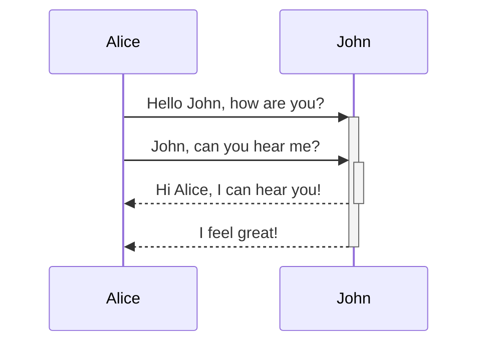

Up:: [[옵시디언 101 가이드 사용법]]

>[!info] 이렇게 따라해보세요!
>1. 현재 활성된 노트(`마크다운과 문법들`) 를 **핀**으로 고정하세요.
>2. [[따라하기]] <- 이 링크를 클릭해보세요. 그러면 새로운 탭에 노트가 열렸을 거에요. 
>3. `따라하기` 노트의 탭을 마우스로 끌어서 옆으로 옮겨보세요.
>4. `따라하기` 노트를 핀으로 고정하세요.
>5. 두 개의 노트를 동시에 띄웠다면, 가이드라인을 보며 직접 따라해보세요.

#### 참고자료
- [Basic formatting syntax - Obsidian Help](https://help.obsidian.md/Editing+and+formatting/Basic+formatting+syntax)
- [Advanced formatting syntax - Obsidian Help](https://help.obsidian.md/Editing+and+formatting/Advanced+formatting+syntax)


> [!Tip] 팁 - 단축키
> `ctrl/cmd + O` : 파일 생성 및 열기
> `ctrl/cmd + P` : 명령어 팔레트


# Heading 1
## Heading 2
### Heading 3
#### Heading 4
##### Heading 5
###### Heading 6
####### Heading 7
(7은 없어요)


# 스타일링 (Styling text)

**Bold**  __Bold__
*Italic* _Italic_
~~Strikethrough~~
==Highlight==
**Bold and _Italic_**
_**Bold** and Italic_

# 목록 (List)
- 불릿 목록 (Bullet / unordered list)
	- `-`를 입력하고 스페이스바를 한 번 눌러주세요.
	- **탭을 누르면 들여쓰기**가 돼요.

1. 순서 목록 (numbered / ordered list)
	1. `1.`을 입력하고 스페이스바를 눌러주세요.

- [ ] 작업 목록 (Task lists)
	- [ ] `- [ ]`를 입력하고 스페이스바를 눌러주세요. (cmd + L)
	      `- [x] ` 체크 표시
	- [x] 체크 표시

## 수평 막대 (Horizontal bar)

가로로 긴 수평 막대를 생성할 수 있어요.

---
___

### 문법
- `***`
- `****` 
- `* * *`
- `---` 
- `----`
- `- - -`
- `___`
- `____`
- `_ _ _`


# 인용 부호 (Quotes)
> 인용 부호는 앞에 `>`를 입력하고 한 칸 띄어씁니다.
> 내가 원하는데로 커스터마이즈 할 수 있어요.

![[콜아웃 CSS.png|300]]


# 콜아웃 (Callout)


>[!info]
>콜아웃으로 예쁘게 꾸밀 수 있어요.

>[!notes]
> `[]` 대괄호 안에 무엇을 입력하느냐에 따라 색상과 아이콘을 바꿀 수 있어요.

>[!abstract] 제목
>대괄호 오른쪽에 텍스트를 입력해서 제목을 지으세요.

>[!faq]- 접었다 폈다
> 대괄호 뒤에 `-`(빼기) 부호를 추가하면 접었다 펼 수 있어요.
> 대괄호 뒤에 `+`(더하기) 부호를 추가하면 항상 펼쳐 있어요.

>[!question]
> > [!todo] 콜아웃 안에 콜아웃을 만들 수 있어요
> > > [!example] 3중도 되죠

>[!tip]
>CSS를 편집해서 Style을 바꿀 수 도 있어요.


참고자료: [Callouts - Obsidian Help](https://help.obsidian.md/Editing+and+formatting/Callouts)


# 표 (Table)

| 순위 | 음식          | 국가   |
|:---- |:------------- |:------ |
| 1    | 치킨          | 한국   |
| 2    | 초밥          | 일본   |
| 3    | 하와이안 피자 | 하와이 | 

```
| 순위 | 음식          | 국가   |
|:---- |:------------- |:------ |
| 1    | 치킨          | 한국   |
| 2    | 초밥          | 일본   |
| 3    | 하와이안 피자 | 하와이 | 
```

플러그인의 도움을 받으면 좀 더 편리해요.
-> [[플러그인#^5sh5em|플러그인/표 (테이블))]]


# Code
## 인라인 코드 (Inline code)
- 문장 안에서 `코드`를 작성할 수 있어요.
- 
- 키보드에서 숫자 `1` 왼쪽에 있는 특수문자에요.
	- 한국어로 `강세표` 영어로 `Grave`라고 해요.
	- `''(따옴표)`와 햇갈리면 안돼요.
	- 만약 `₩`이 나온다면 `한영`을 누르고 다시 입력해보세요.


## 코드 블록 (Code block)
```
프로그래밍 언어를 설정할 수 있어요.
코드를 실행할 수 있는 커뮤니티 플로그인도 있어요.
```

```py
var Greeting = "Hello, I'm tagg"
print(Greeting)
```

```js
let Greeting = "Hello, I'm tagg";
document.writes(Greeting);
```

[지원하는 언어 리스트](https://prismjs.com/#supported-languages)


# 링크
- 외부 링크: `[공백도 OK](url)`
- 내부 링크: `[[파일 이름]]`
- 표시되는 텍스트 바꾸기: 
  `[[AAA|BBB]]`  ->  [[Atlas/Note/AAA|BBB]]
  `[네이버](https://naver.com)` -> [네이버](https://naver.com)
- place holder (플레이스 홀더)
	  - 노트는 없지만 링크를 만들어 놓을 수 있다.

👉 **[[노트 관리법#노트 연결|자세히 알아보기]]**


# 이미지
- `[]`앞에 `!(느낌표)`를 붙이세요
- `[파일명|이미지 크기]`: 키보드에서 대괄호 오른쪽에 있는 `|`를 입력하면 돼요.
- `![[고양이 사진.png|100]]`
- ![[고양이 사진.png|100]]
- ``
  

%%이 고양이 태극이 닮아따%%


# 수식 (Math)
> \$$ 
> \begin{vmatrix}a & b\\
> c & d \end{vmatrix}=ad-bc 
> \$$

$$ 
\begin{vmatrix}a & b\\
c & d \end{vmatrix}=ad-bc 
$$

### 참고:
- [MathJax basic tutorial and quick reference - Mathematics Meta Stack Exchange](https://math.meta.stackexchange.com/questions/5020/mathjax-basic-tutorial-and-quick-reference)
- [The TeX/LaTeX Extension List — MathJax 3.2 documentation](https://docs.mathjax.org/en/latest/input/tex/extensions/index.html)

# 다이어그램 (Diagram) - Mermaid
>\`\`\`mermaid
> 	sequenceDiagram 
> 		Alice->>+John: Hello John, how are you?
> 		Alice->>+John: John, can you hear me?
> 		John-->>-Alice: Hi Alice, I can hear you!
> 		John-->>-Alice: I feel great!
\`\`\`



### 참고:
- https://mermaid.js.org

# 각주 (Footnotes)
### 문법 
1. `[^1]` 
2. `[^1]: 설명`

숫자가 아닌 텍스트로도 가능해요. `[^텍스트]`

### 예시 및 설명
>사과[^1]는 맛있어!
>기차[^2]는 빨라~

>각주[^각주]는 숫자가 아닌 문자로도 입력할 수 있어요.
>하지만 '미리보기 모드'에서는 숫자로 보여요.


[^1]: 사과는 과일이다.
[^2]: 기차는 선로에 따라 움직이는 육상 교통수단이다.
[^각주]: `[^각주]`


# 댓글 (Comments)
- 문법: `%% 텍스트 %%` 
- **`cmd/ctrl + E`를 눌러보세요.**


%% 댓글은 편집 모드에서만 보이고 미리보기 모드에서 보이지 않아요 !!! %%


#   <-- [[파일 관리 및 편집기 기본]]  |  [[노트 관리법]] -->
[[옵시디언 101 가이드 사용법]]